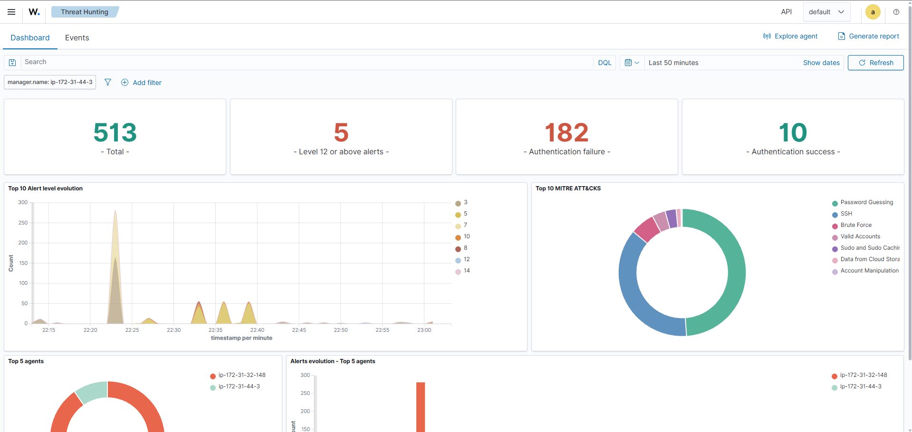
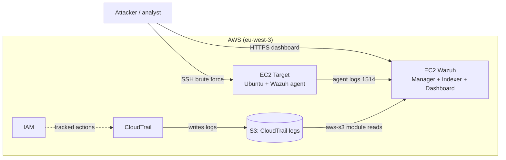
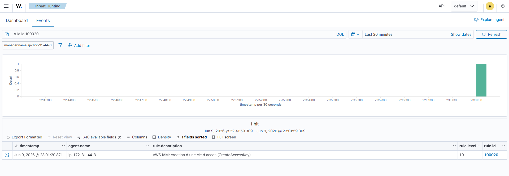
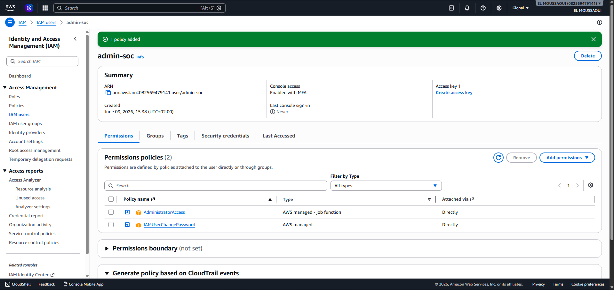
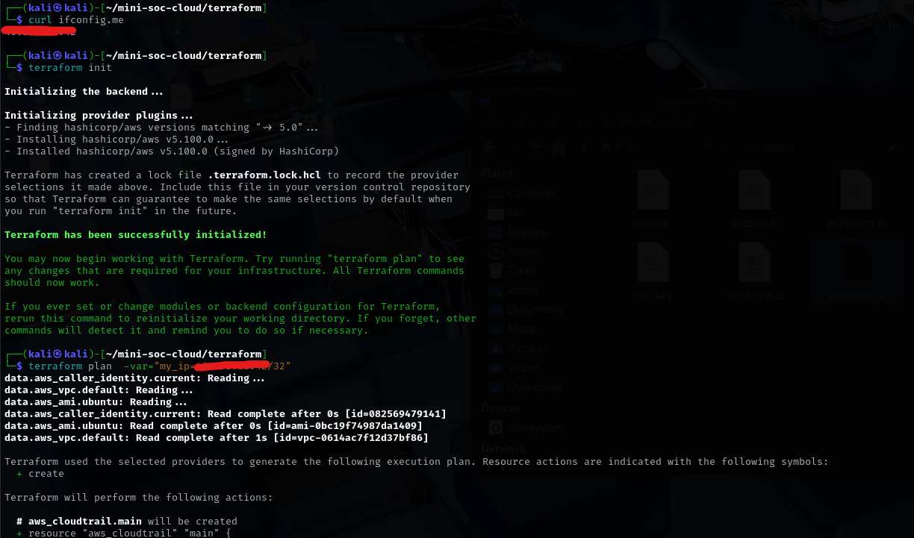
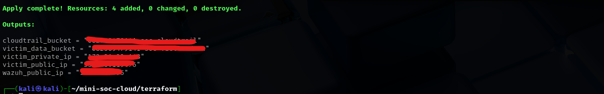
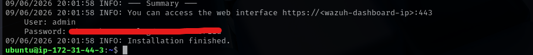
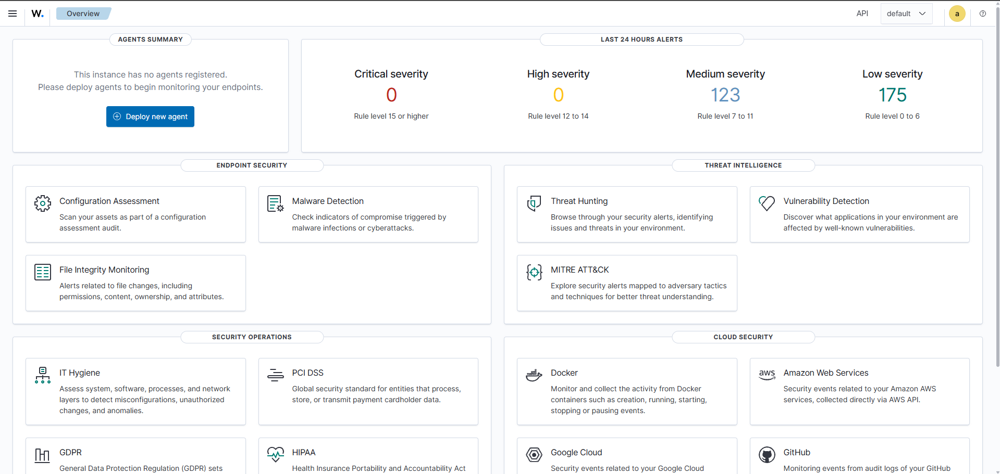
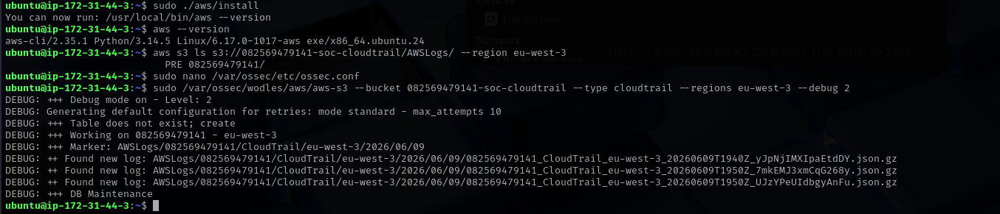

# Cloud Mini-SOC on AWS with Wazuh

A fully Infrastructure-as-Code lab that deploys a Security Operations Center on AWS and detects real attacks end to end — from the host to the cloud control plane — using **Wazuh** as the SIEM.

> Hands-on cybersecurity portfolio project. Every detection follows the full chain **threat → log → detection rule → alert**, mapped to MITRE ATT&CK.



*Seven adversary techniques detected across host and cloud surfaces in a single run.*

## Architecture



## Stack

- **Cloud:** AWS — EC2, S3, IAM, CloudTrail
- **SIEM:** Wazuh 4.14 (all-in-one: Manager + Indexer + Dashboard)
- **Infrastructure as Code:** Terraform
- **Detection engineering:** custom rules mapped to MITRE ATT&CK
- **Offensive tooling:** Hydra, AWS CLI

## Detection use cases

| # | Scenario | Surface | MITRE ATT&CK | Wazuh rule |
|---|----------|---------|--------------|------------|
| A | SSH brute force | Host | T1110 | native `5712` |
| B | S3 bucket made public | Cloud | T1530 | custom `100010` |
| C | IAM access key creation | Cloud | T1098 | custom `100020` |
| D | IAM privilege escalation | Cloud | T1078 | custom `100030` |

## Detection evidence

**A — SSH brute force (rule 5712, T1110)**

The attack, run with Hydra against the target:


Correlated into a brute-force alert by Wazuh:


**B — S3 bucket made public (rule 100010, T1530)**


**C — IAM access key creation (rule 100020, T1098)**


**D — IAM privilege escalation (rule 100030, T1078)**


**Cloud control-plane ingestion (CloudTrail via Wazuh's `aws-s3` module)**


## How it works

Two complementary detection surfaces:

- **Host-based detection** — a Wazuh agent on the target reads system logs (`/var/log/auth.log`) and forwards them to the manager, where correlation rules turn isolated SSH failures into a brute-force alert.
- **Cloud control-plane detection** — CloudTrail records every AWS API call into an S3 bucket; Wazuh's `aws-s3` module ingests those logs, and custom rules flag risky actions (public buckets, IAM key creation, privilege escalation).

**Security design choice:** the Wazuh server reads CloudTrail logs through an **IAM instance role** scoped to read-only access on the log bucket — least privilege, with no long-lived credentials stored on disk.

A detail worth highlighting: S3 events are logged in the bucket's region (`eu-west-3`), while IAM is a global service whose events are always logged in `us-east-1`. The multi-region trail and the ingestion module account for both.

## How it was built

Account hardening (MFA + least-privilege IAM admin user):




Infrastructure deployed with Terraform (`terraform plan` / `apply`):




Wazuh installed with the official all-in-one assistant, then the dashboard:




CloudTrail logs ingested by the Wazuh `aws-s3` module:



## Deploy it yourself

Prerequisites: an AWS account, Terraform, AWS CLI, an SSH client.

```bash
cd terraform
ssh-keygen -t ed25519 -f soc-key -N ""
terraform init
terraform apply -var="my_ip=$(curl -s ifconfig.me)/32"
```

Then SSH into the Wazuh server and run the official installer:

```bash
curl -sO https://packages.wazuh.com/4.14/wazuh-install.sh && sudo bash ./wazuh-install.sh -a
```

Deploy the custom rules from `detection-rules/local_rules.xml` to `/var/ossec/etc/rules/local_rules.xml` on the manager, restart it, then replay the attacks with `attacks/run_attacks.sh`.

## Repository structure

```
.
├── README.md
├── terraform/              # Infrastructure as Code (EC2, S3, IAM, CloudTrail)
├── detection-rules/
│   └── local_rules.xml     # custom Wazuh rules (scenarios B, C, D)
├── attacks/
│   └── run_attacks.sh      # replays the four attack scenarios
└── docs/
    └── screenshots/        # evidence (alerts, attacks, build steps)
```

## Notes & limitations

This is a demonstration lab, intentionally insecure in places (password SSH auth enabled on the target, single-node Wazuh, self-signed dashboard certificate). A production deployment would use a Wazuh cluster, trusted TLS certificates, hardened instances, and automated response.

## Author

Built as part of a cybersecurity work-study (alternance) application.
