# Cloud Mini-SOC on AWS with Wazuh

A hands-on cybersecurity portfolio project that deploys a mini Security Operations Center on AWS using **Wazuh** as the SIEM.

The lab detects real security events across two surfaces:

* a Linux host monitored with a Wazuh agent;
* the AWS cloud control plane monitored through CloudTrail logs.

Every detection follows the full chain:

**threat → log → detection rule → alert**


---

## Project Overview

This project demonstrates how a cloud-based SOC can collect, correlate and detect security events from both host-level activity and AWS API activity.

The environment is deployed with Terraform and includes:

* an EC2 instance running Wazuh Manager, Indexer and Dashboard;
* an Ubuntu EC2 target machine with the Wazuh agent installed;
* AWS CloudTrail configured to send logs to S3;
* Wazuh AWS integration through the `aws-s3` module;
* custom Wazuh detection rules for AWS IAM and S3 events;
* simulated attacks to validate the detections.

---

## Architecture

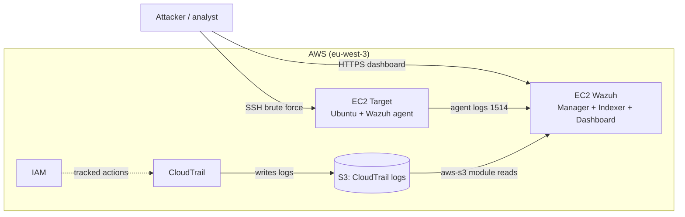

---

## Tech Stack

| Category               | Technology         |
| ---------------------- | ------------------ |
| Cloud provider         | AWS                |
| Infrastructure as Code | Terraform          |
| SIEM                   | Wazuh 4.14         |
| Compute                | EC2                |
| Cloud logging          | CloudTrail         |
| Storage                | S3                 |
| Identity               | IAM                |
| Attack simulation      | Hydra, AWS CLI     |
| Operating system       | Ubuntu, Kali Linux |

---

## Detection Use Cases

| # | Scenario                   | Surface | MITRE ATT&CK                    | Wazuh Rule |
| - | -------------------------- | ------- | ------------------------------- | ---------- |
| A | SSH invalid user attempts  | Host    | SSH / Password Guessing         | `5710`     |
| B | SSH brute force            | Host    | T1110 - Brute Force             | `5712`     |
| C | SSH authentication failure | Host    | SSH / Authentication Failure    | `5760`     |
| D | S3 bucket made public      | Cloud   | T1530 - Data from Cloud Storage | `100010`   |
| E | IAM access key creation    | Cloud   | T1098 - Account Manipulation    | `100020`   |
| F | IAM privilege escalation   | Cloud   | T1078 - Valid Accounts          | `100030`   |

---

## Build Evidence

### 1. AWS Account Hardening

The project started with AWS account security basics:

* MFA enabled on the root account;
* a dedicated IAM admin user created;
* administrative permissions assigned to the IAM user;
* AWS CLI configured for Terraform deployment.

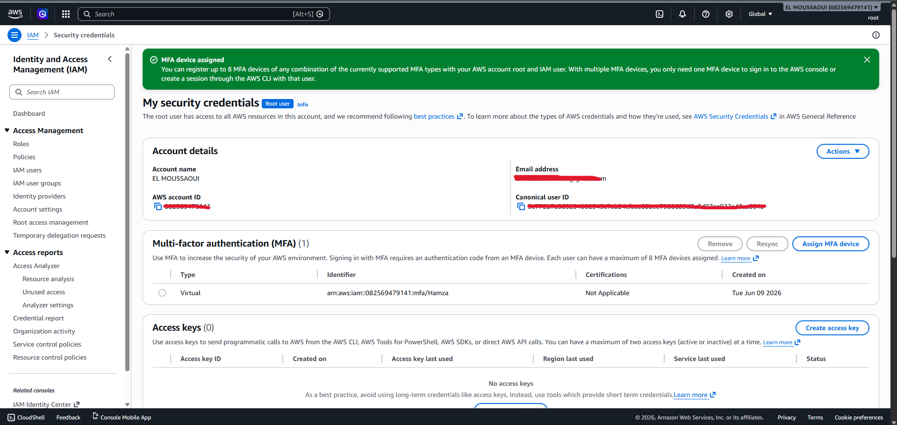

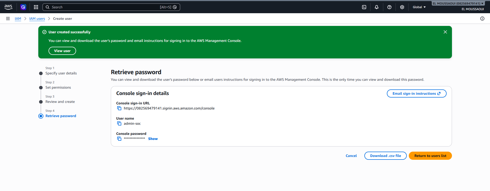


---

### 2. Infrastructure Deployment with Terraform

Terraform was used to deploy the AWS infrastructure in a repeatable way.


The deployment created:

* the Wazuh EC2 instance;
* the target EC2 instance;
* security groups;
* S3 buckets;
* CloudTrail;
* IAM role and permissions for Wazuh log ingestion.

---

### 3. Wazuh Installation

Wazuh was deployed as an all-in-one installation including:

* Wazuh Manager;
* Wazuh Indexer;
* Wazuh Dashboard.

A swap file was configured before installation to improve stability during setup.

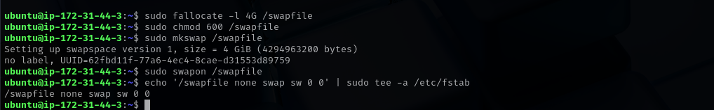


---

### 4. CloudTrail Log Ingestion

CloudTrail logs were stored in an S3 bucket and ingested by Wazuh using the `aws-s3` module.

The Wazuh server uses an IAM instance role with read-only access to the CloudTrail bucket. This avoids storing long-term AWS credentials on the Wazuh instance.


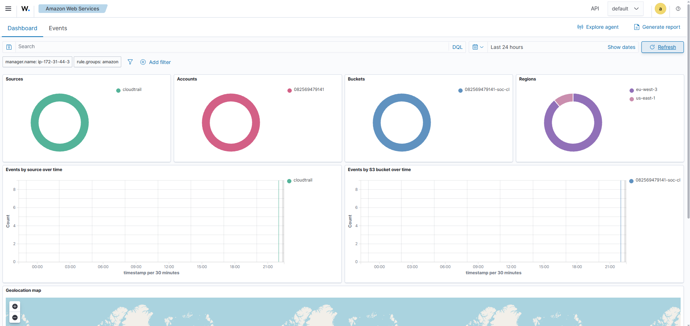

---

### 5. Wazuh Agent Deployment

A Wazuh agent was installed on the Ubuntu target instance to collect host-level security logs.

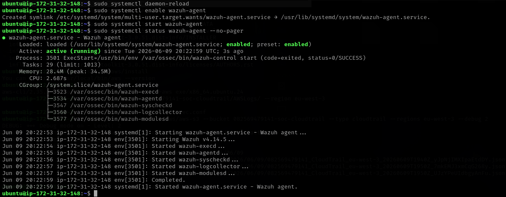

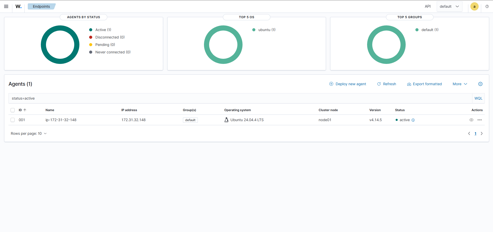

---

## Detection Evidence

### A — SSH Invalid User Attempts

Wazuh detected SSH authentication attempts using invalid or suspicious login patterns.

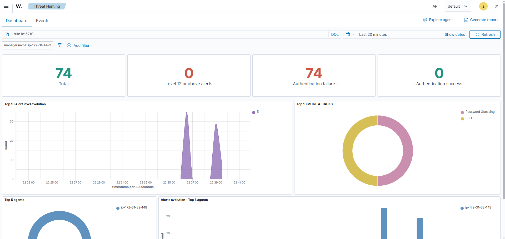

---

### B — SSH Brute Force

Hydra was used to simulate a brute-force attack against the target EC2 instance.

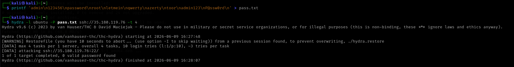

Wazuh correlated the failed authentication attempts into a brute-force alert.

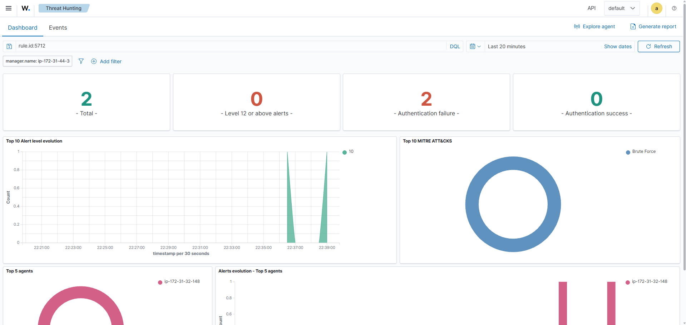

---

### C — SSH Authentication Failure

Wazuh also detected repeated SSH authentication failures.

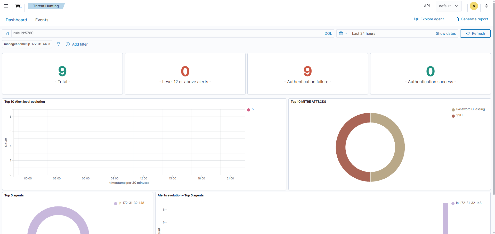

---

### D — S3 Bucket Made Public

A risky S3 bucket policy change was simulated. CloudTrail logged the AWS API call, and Wazuh generated a custom alert.

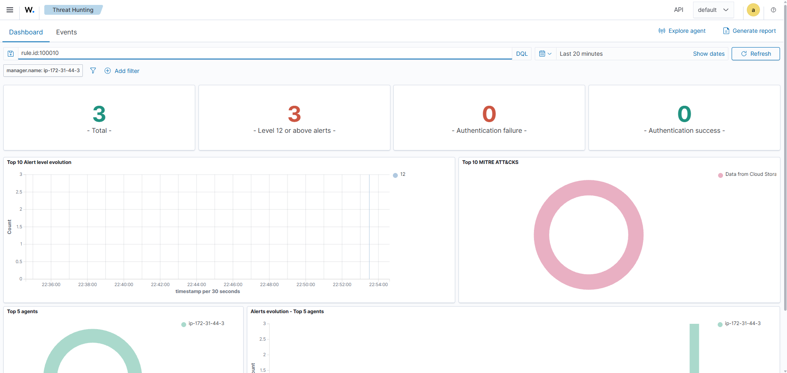

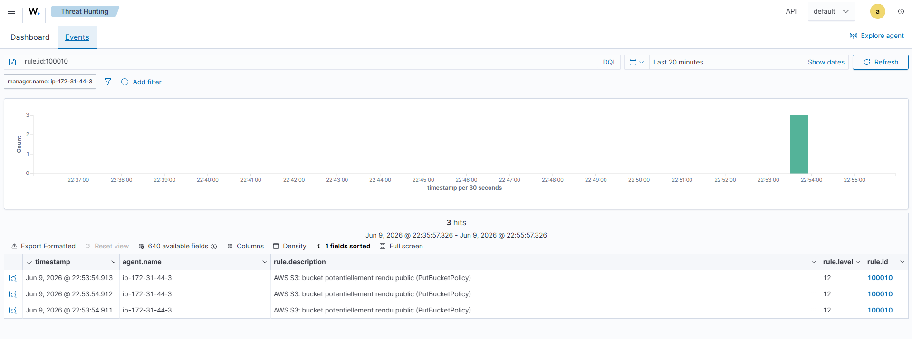

---

### E — IAM Access Key Creation

A new access key was created for a test IAM user. This can be a persistence technique after account compromise.


---

### F — IAM Privilege Escalation

The AWS managed `AdministratorAccess` policy was attached to a test IAM user to simulate privilege escalation.

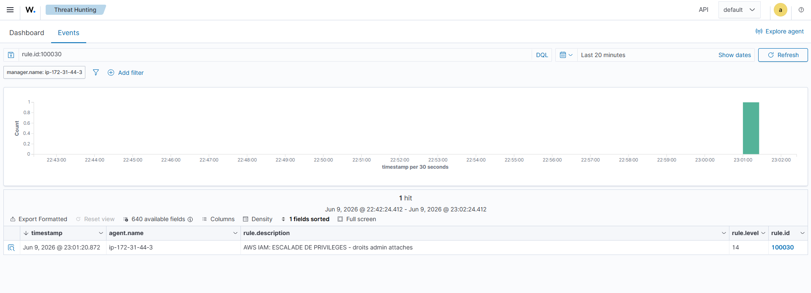

---

## Custom Detection Rules

The custom Wazuh rules are stored in:

```text
detection-rules/local_rules.xml
```

Implemented custom rules:

| Rule ID  | Description                                          |
| -------- | ---------------------------------------------------- |
| `100010` | Detects risky S3 public access configuration changes |
| `100020` | Detects IAM access key creation                      |
| `100030` | Detects IAM administrator policy attachment          |

Example detection logic:

```xml
<rule id="100030" level="14">
  <if_sid>80200</if_sid>
  <field name="aws.eventName">^AttachUserPolicy$|^AttachRolePolicy$|^PutUserPolicy$</field>
  <field name="aws.requestParameters.policyArn">AdministratorAccess</field>
  <description>AWS IAM: privilege escalation - administrator policy attached</description>
  <mitre>
    <id>T1078</id>
  </mitre>
</rule>
```

---

## Repository Structure

```text
.
├── README.md
├── terraform/
│   ├── main.tf
│   ├── outputs.tf
│   ├── providers.tf
│   └── variables.tf
├── detection-rules/
│   └── local_rules.xml
├── attacks/
│   └── run_attacks.sh
└── docs/
    └── screenshots/
```

---

## How to Deploy

### Prerequisites

* AWS account
* AWS CLI
* Terraform
* SSH client
* Git

### Terraform Deployment

```bash
cd terraform
ssh-keygen -t ed25519 -f soc-key -N ""
terraform init
terraform plan -var="my_ip=$(curl -s ifconfig.me)/32"
terraform apply -var="my_ip=$(curl -s ifconfig.me)/32"
```

### Wazuh Installation

Connect to the Wazuh EC2 instance:

```bash
ssh -i soc-key ubuntu@<wazuh_public_ip>
```

Install Wazuh:

```bash
curl -sO https://packages.wazuh.com/4.14/wazuh-install.sh
sudo bash ./wazuh-install.sh -a
```

### CloudTrail Ingestion

Configure the Wazuh AWS module in:

```text
/var/ossec/etc/ossec.conf
```

Then restart the manager:

```bash
sudo systemctl restart wazuh-manager
```

### Agent Deployment

Install the Wazuh agent on the target Ubuntu instance and verify that it appears as active in the Wazuh dashboard.

---

## Attack Simulation

The attack commands are documented in:

```text
attacks/run_attacks.sh
```

Covered simulations:

* SSH brute force with Hydra;
* S3 public access policy modification;
* IAM access key creation;
* IAM administrator policy attachment.

---

## Security Notes

This is a controlled demonstration lab.

Some choices are intentionally insecure for learning and detection purposes:

* SSH password authentication enabled on the target machine;
* test IAM user used for attack simulation;
* self-signed Wazuh dashboard certificate;
* single-node Wazuh deployment;
* no production hardening.

A production-ready deployment would require:

* hardened EC2 instances;
* trusted TLS certificates;
* strict IAM least privilege;
* Wazuh cluster architecture;
* centralized alerting;
* log retention policies;
* automated incident response playbooks.

---

## What I Learned

Through this project, I practiced:

* deploying cloud infrastructure with Terraform;
* configuring AWS CloudTrail and S3 log storage;
* integrating AWS logs into Wazuh;
* deploying and monitoring a Wazuh agent;
* writing custom SIEM detection rules;
* mapping detections to MITRE ATT&CK;
* simulating realistic cloud and host attack scenarios;
* documenting security evidence for a professional portfolio.

---

## Author

Built as a cybersecurity portfolio project for a work-study / apprenticeship application.
